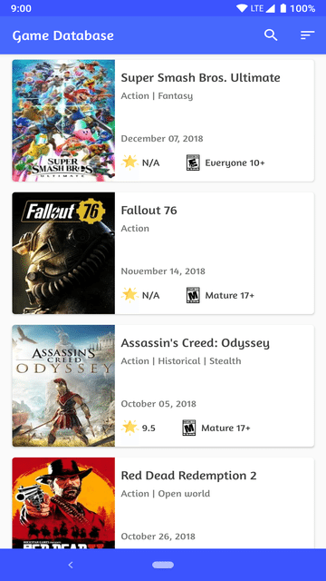
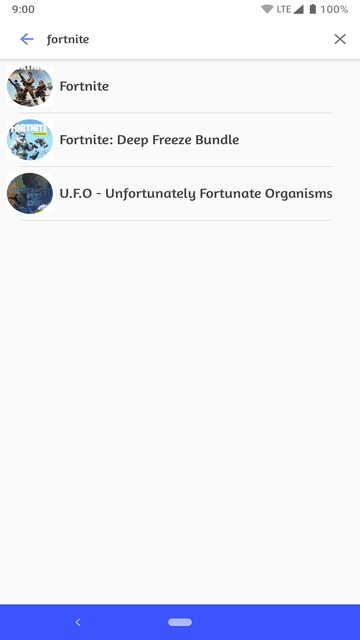
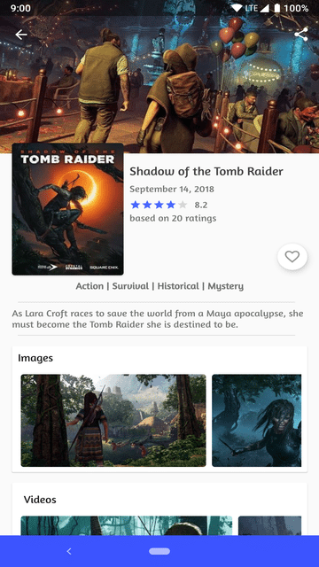
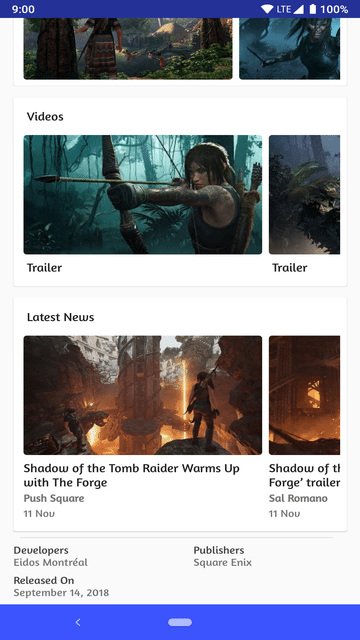
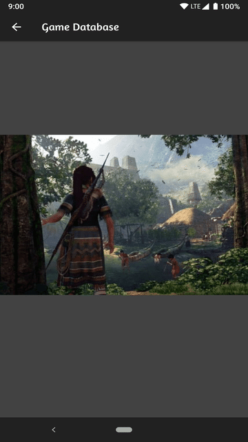
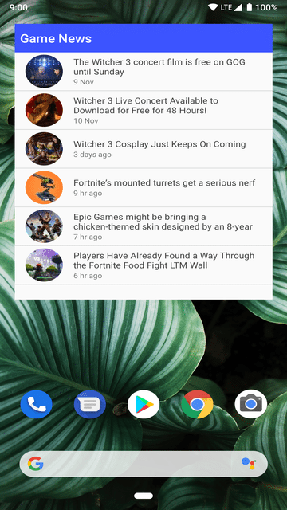

# # \[ 🚧 Work in progress 👷‍♀️⛏👷🔧️👷🔧 🚧 ] **Game Database App**

## Udacity Android Developer Nanodegree Program - Capstone project

# Features
Using this app it easier for game lovers to find popular, top rated and
upcoming games and keep up-to-date with the latest game information.

- Explore games and see their information in details.
- Watch game videos and images.
- Get the latest news about your favorite game on the home screen.

# Screenshots

Game List Screen            |  Game Search Screen
:-------------------------:|:-------------------------:
 | 

Game Detail Screen 1           |  Game Detail Screen 2
:-------------------------:|:-------------------------:
 | 

Game Screenshot Viewer            |  App Widget
:-------------------------:|:-------------------------:
 | 

# Technologies

- Java
- MVVM
- RxJava 2/AutoDispose
- Debugging tooling
  - Leak Canary, Timber, Stetho
- AndroidX/Jetpack
- Dagger 2
- Room (Arch components)
- Firebase
- Glide
- Okio/OkHttp 3/Retrofit 2/Moshi

---

## Use the project with your own IGDB API key

* Get you own IGDB API key. See the [get an API key][0].
* Find `.gradle` folder in your home directory, create a file named `gradle.properties` (if not present).

    Usually it can be found at:

        Windows: C:\Users\<Your Username>\.gradle
        Mac: /Users/<Your Username>/.gradle
        Linux: /home/<Your Username>/.gradle

        Inside it there would be a file named gradle.properties (just create it if there isn’t any).

* Open the `gradle.properties` file and paste your API key into the value of the `IGDB_API_KEY` property, like this

    `IGDB_API_KEY=PASTE-YOUR-API-KEY-HERE`

* Now you should be able to successfully sync the project.

License
-------
    Copyright (C) 2018 Arpan Sarkar

    Licensed under the Apache License, Version 2.0 (the "License");
    you may not use this file except in compliance with the License.
    You may obtain a copy of the License at

       http://www.apache.org/licenses/LICENSE-2.0

    Unless required by applicable law or agreed to in writing, software
    distributed under the License is distributed on an "AS IS" BASIS,
    WITHOUT WARRANTIES OR CONDITIONS OF ANY KIND, either express or implied.
    See the License for the specific language governing permissions and
    limitations under the License.

[0]: https://www.igdb.com/api